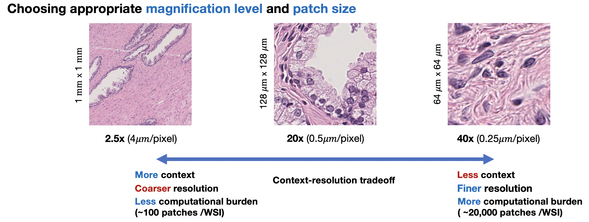
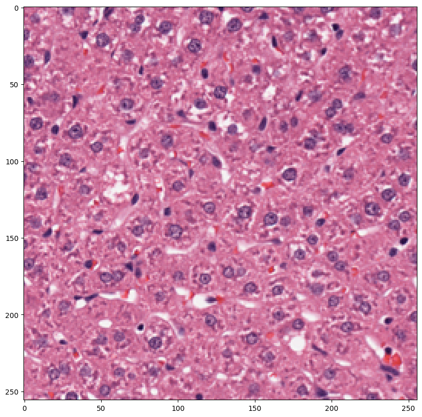
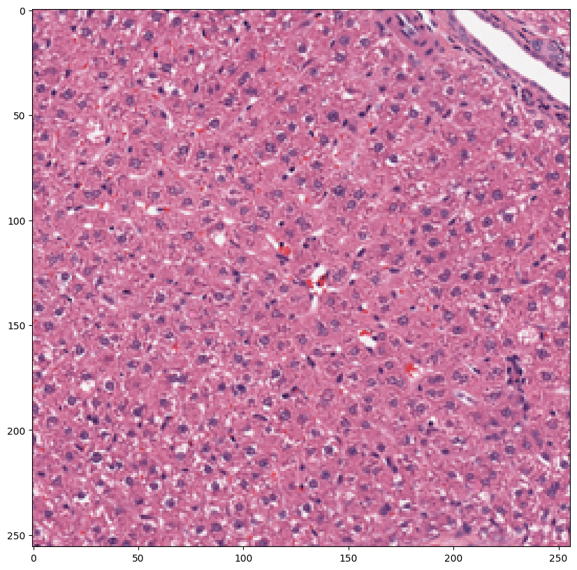
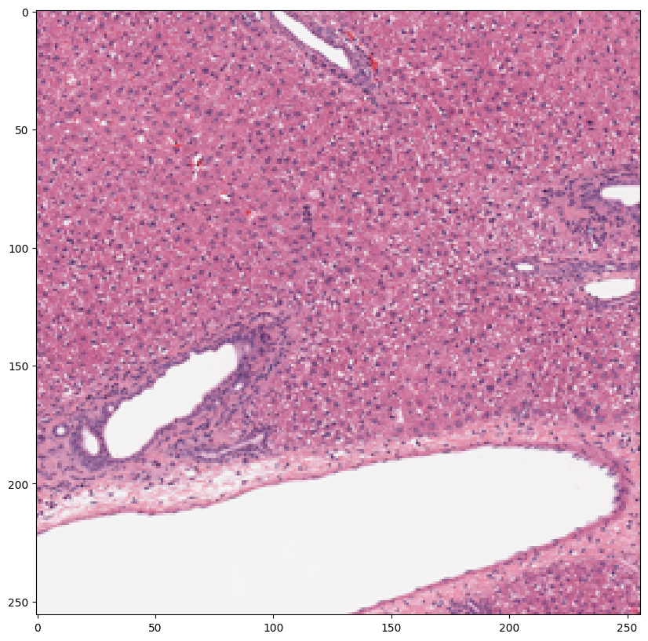
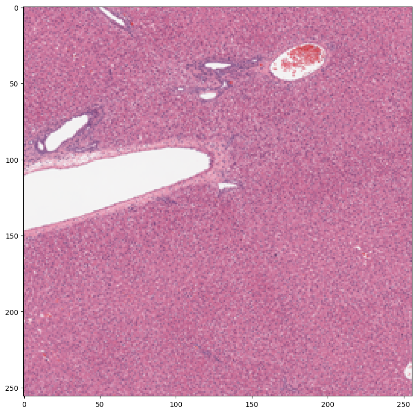

# Capth学习笔记
## 1.安装Qupath和下载需要的全幅切片图像

下载QuPath：
https://qupath.readthedocs.io/en/0.4/docs/intro/installation.html#download-install

从这里下载全幅切片图像：

https://drive.google.com/file/d/1GWtuOLRf6-7C8zCG6b3JdYDPk_C5IS3_/view?usp=sharing
https://drive.google.com/file/d/1o9Es1qdY15y8q_gsjX3KVkn7HS8amlSF/view?usp=sharing
使用QuPath探索这两个全幅切片图像（WSIs）：

一张带有坏死区域的大鼠肝脏尸检图像
一张侵袭性乳腺癌（BRCA）的TCGA样本图像

## 2.OpenSlide安装

    # Install openslide 
    !pip install openslide-python

这里未安装pandas和matplotlib，需要安装： 

    pip install pandas    
    pip install matplotlib

### Accessing slide properties and reading

    # Import openslide
    # 理解幻灯片属性 

    import os
    import pandas as pd
    from glob import glob
    from pprint import pprint
    import matplotlib.pyplot as plt 
    from openslide import OpenSlide

### 遇到错误
读取openslide包出错  
    
    from openslide import OpenSlide

遇到的错误是由于 Python 的 openslide 库无法找到必需的动态链接库 (libopenslide-0.dll 或 libopenslide-1.dll)，这些文件是 OpenSlide 在 Windows 上运行所必须的。

解决方法：从openslide官网（ https://openslide.org/ ）安装对应的openslide库。
在 Windows 上，下载 OpenSlide Windows 二进制文件并提取它们 拖动到已知路径。然后，在语句中导入：openslidewith os.add_dll_directory()

    #The path can also be read from a config file, etc.
    OPENSLIDE_PATH = r'c:\path\to\openslide-win64\bin'

    import os
    if hasattr(os, 'add_dll_directory'):
        # Windows
        with os.add_dll_directory(OPENSLIDE_PATH):
            import openslide
    else:
        import openslide

## 3.Accessing slide properties and reading

    slide_path = os.path.join('data', 'slides', 'necrosis.tiff')
    slide = OpenSlide(slide_path)

    # 检查最高分辨率（20x）下的图像尺寸： 
    print('图像尺寸为：', slide.dimensions[0], ' x ', slide.dimensions[1])

    # 检查预提取级别的数量：
    print('级别数量：', slide.level_count)

    # 检查每个级别的尺寸：
    print('所有级别：')
    for dims in slide.level_dimensions:
        print('    - (', dims[0], ' x ', dims[1], ')')

    # 检查幻灯片大小 
    print(f"文件大小：{round(os.path.getsize(slide_path) / 1024 ** 2, 2)} MB")

    # 可选：检查所有幻灯片属性 
    # pprint(dict(slide.properties))

输出：

    图像尺寸为： 61751  x  35769
    级别数量： 3
    所有级别：
        - ( 61751  x  35769 )
        - ( 15437  x  8942 )
        - ( 3859  x  2235 )
    文件大小：671.22 MB

## 4.Choosing appropriate magnification levels and patch size
### 提取和可视化区域

    # 提取和可视化区域

    # 定义提取区域的左上角坐标
    topleft = (25000, 25000)
    # 定义提取区域的大小
    size = (256, 256)

    # 对于每个级别进行迭代，共迭代4次
    for l in range(4):
        # 更新提取区域的大小，每次乘以2
        size = (size[0] * 2, size[1] * 2)
        # 从幻灯片中读取指定区域
        region = slide.read_region(topleft, 0, size)
        # 调整提取的区域大小为 (256, 256)
        region = region.resize((256, 256))
        # 创建一个新的图形窗口，设置图形大小
        plt.figure(figsize=(10, 10))
        # 在图形窗口中显示提取的区域
        plt.imshow(region)

输出：     

## 5.组织分割

### 组织分割的重要性：
- 去除非生物背景：在组织病理学图像中，感兴趣的组织嵌入在背景中，这些背景经常包含伪影、染色、笔迹或其他非生物元素。这些元素没有任何有意义的生物信息，可能会干扰对组织结构的准确分析。通过分割和去除背景，计算病理学算法可以仅关注相关的组织区域，从而获得更精确和可靠的结果。

- 消除假相关性：背景区域可能在下游分析中引入假相关性。如果背景未被正确去除，图像分析算法可能无意中将重要性分配给背景中存在的无关特征或模式。这可能导致错误的关联或误导性结果，影响计算病理学发现的准确性和可靠性。组织分割有助于通过仅分析生物学相关的成分来避免此类假相关性。

- 降低计算复杂性：背景区域通常会增加图像分析算法的整体复杂性，而不提供任何有意义的信息。将这些区域包含在计算过程中会不必要地增加计算负担和分析所需的时间。通过分割和去除背景，可以显著降低计算复杂性，实现更高效和流畅的分析工作流程。这种优化在需要处理大量组织病理学图像的大规模研究或应用中尤为宝贵。

### 组织分割的主要技术：
- 阈值法：这是一种直接的技术，通过设置特定的强度阈值来区分组织和背景。强度值高于阈值的像素被归类为组织，低于阈值的则被视为背景。这种方法假定组织和背景之间有明显的对比，适用于边界清晰的图像。

- 基于区域的方法：这些方法利用图像的颜色、纹理或强度变化等属性来识别组织区域。如区域生长、分水岭分割或图割等技术分析邻近像素的属性，迭代扩展或划分区域直到确定组织边界。当组织外观存在变化或组织与背景表现出不同特征时，基于区域的方法非常有用。

- 基于机器学习的方法：随着机器学习的进步，可以使用监督学习或无监督学习等技术进行组织分割。监督学习涉及在一组标记的图像上训练模型，模型基于提供的注释学习区分组织和背景区域。无监督学习方法，如聚类或自动编码器，可以识别图像数据中的模式或簇，实现组织与背景的分离。

- 基于深度学习的方法：深度学习方法，特别是卷积神经网络（CNN），在组织分割任务中显示出了显著的成功。这些模型可以直接从图像数据中学习层次化特征并进行像素级预测。完全卷积网络（FCN）、U-Net 或 Mask R-CNN 是常用的组织分割架构。

### 包含组织分割的现有库：
- CLAM（参见 https://github.com/mahmoodlab/CLAM ）
- HistoCartography（参见 https://github.com/BiomedSciAI/histocartography ）
- TIA ToolBox（参见 https://github.com/TissueImageAnalytics/tiatoolbox ） 现有工具的概览可以在这里找到。

###代码部分

        import numpy as np
        import cv2

        def segment_tissue(
            wsi,
            seg_level=2,
            sthresh=20,
            sthresh_up = 255,
            mthresh=7,
            close=0,
            use_otsu=False, 
            filter_params={'a_t':100, 'a_h': 4, 'max_n_holes': 5},
            ref_patch_size=512,
            exclude_ids=[],
            keep_ids=[]):
                """
                    通过HSV -> 中值阈值 -> 二值化对组织进行分割
                """
                
                def _filter_contours(contours, hierarchy, filter_params):
                    """
                        根据面积过滤轮廓。
                    """
                    filtered = []

                    # 找到前景轮廓的索引（parent == -1）
                    # np.flatnonzero 
                    hierarchy_1 = np.flatnonzero(hierarchy[:,1] == -1) 
                    all_holes = []
                    
                    # 遍历前景轮廓索引
                    for cont_idx in hierarchy_1:
                        # 实际轮廓
                        cont = contours[cont_idx]
                        # 此轮廓中包含的孔的索引（父轮廓的子轮廓）
                        holes = np.flatnonzero(hierarchy[:, 1] == cont_idx)
                        # 获取每个孔的轮廓面积
                        hole_areas = [cv2.contourArea(contours[hole_idx]) for hole_idx in holes]
                        # 实际前景轮廓区域的面积
                        a = cv2.contourArea(cont)
                        a = a - np.array(hole_areas).sum()
                        if a == 0: continue
                        if tuple((filter_params['a_t'],)) < tuple((a,)): 
                            filtered.append(cont_idx)
                            all_holes.append(holes)

                    foreground_contours = [contours[cont_idx] for cont_idx in filtered]
                    
                    hole_contours = []

                    for hole_ids in all_holes:
                        unfiltered_holes = [contours[idx] for idx in hole_ids ]
                        unfilered_holes = sorted(unfiltered_holes, key=cv2.contourArea, reverse=True)
                        # 取最大的max_n_holes个孔
                        unfilered_holes = unfilered_holes[:filter_params['max_n_holes']]
                        filtered_holes = []
                        
                        # 过滤这些孔
                        for hole in unfilered_holes:
                            if cv2.contourArea(hole) > filter_params['a_h']:
                                filtered_holes.append(hole)

                        hole_contours.append(filtered_holes)

                    return foreground_contours, hole_contours
                
                img = np.array(wsi.read_region((0,0), seg_level, wsi.level_dimensions[seg_level]))
                img_hsv = cv2.cvtColor(img, cv2.COLOR_RGB2HSV)     # 转换为HSV颜色空间
                img_med = cv2.medianBlur(img_hsv[:,:,1], mthresh)  # 应用中值模糊
                        
                # 阈值化
                if use_otsu:
                    _, img_otsu = cv2.threshold(img_med, 0, sthresh_up, cv2.THRESH_OTSU+cv2.THRESH_BINARY)
                else:
                    _, img_otsu = cv2.threshold(img_med, sthresh, sthresh_up, cv2.THRESH_BINARY)

                # 形态学闭运算
                if close > 0:
                    kernel = np.ones((close, close), np.uint8)
                    img_otsu = cv2.morphologyEx(img_otsu, cv2.MORPH_CLOSE, kernel)                 

                scale = int(wsi.level_dimensions[0][0] / wsi.level_dimensions[seg_level][0])
                scaled_ref_patch_area = int(ref_patch_size**2 / (scale * scale))
                filter_params = filter_params.copy()
                filter_params['a_t'] = filter_params['a_t'] * scaled_ref_patch_area
                filter_params['a_h'] = filter_params['a_h'] * scaled_ref_patch_area
                
                # 查找和过滤轮廓
                contours, hierarchy = cv2.findContours(img_otsu, cv2.RETR_CCOMP, cv2.CHAIN_APPROX_NONE) # 查找轮廓 
                hierarchy = np.squeeze(hierarchy, axis=(0,))[:, 2:]
                if filter_params:
                    foreground_contours, hole_contours = _filter_contours(contours, hierarchy, filter_params)  # 过滤掉伪影

                contours_tissue = scale_contour_dim(foreground_contours, scale)
                holes_tissue = scale_holes_dim(hole_contours, scale)

                if len(keep_ids) > 0:
                    contour_ids = set(keep_ids) - set(exclude_ids)
                else:
                    contour_ids = set(np.arange(len(contours_tissue))) - set(exclude_ids)

                contours_tissue = [contours_tissue[i] for i in contour_ids]
                holes_tissue = [holes_tissue[i] for i in contour_ids]
                
                return contours_tissue, holes_tissue

        def scale_contour_dim(contours, scale):
            return [np.array(cont * scale, dtype='int32') for cont in contours]

        def scale_holes_dim(contours, scale):
            return [[np.array(hole * scale, dtype = 'int32') for hole in holes] for holes in contours]

        # 调用segment_tissue函数进行组织分割
        contours_tissue, holes_tissue = segment_tissue(slide)

        # 打印检测到的轮廓数和孔数
        print('检测到的轮廓数:', len(contours_tissue))
        print('检测到的孔数:', sum([len(entry) for entry in holes_tissue]))
检测到的轮廓数: 2  
检测到的孔数: 4

    # 在缩略图上可视化分割质量

    import math  # 导入用于数学操作的 math 库
    from PIL import Image  # 从 PIL 库导入 Image 类

    def vis_wsi(wsi,  # 可视化整张幻灯片图像（WSI）及其中的轮廓和孔
                contours_tissue,  # 表示组织区域的轮廓
                holes_tissue,  # 组织区域内的孔
                coords=None,  # 要突出显示的区域的坐标（可选）
                seg_level=2,  # 分割级别（默认为2）
                color=(0,255,0),  # 轮廓线的颜色（默认为绿色）
                hole_color=(0,0,255),  # 孔轮廓的颜色（默认为蓝色）
                line_thickness=250,  # 轮廓线的粗细（默认为250）
                custom_downsample=1,  # 图像调整大小的下采样因子（默认为1）
                number_contours=False,  # 是否为轮廓添加编号（默认为False）
        ):

        downsample = int(wsi.level_dimensions[0][0] / wsi.level_dimensions[seg_level][0])  # 计算下采样因子
        scale = [1/downsample, 1/downsample]  # 计算调整大小的比例
        top_left = (0,0)  # 定义要可视化的区域的左上角
        region_size = wsi.level_dimensions[seg_level]  # 获取要可视化的区域的大小

        img = np.array(wsi.read_region(top_left, seg_level, region_size).convert("RGB"))  # 读取幻灯片的区域并转换为RGB格式

        offset = tuple(-(np.array(top_left) * scale).astype(int))  # 计算轮廓绘制的偏移量
        line_thickness = int(line_thickness * math.sqrt(scale[0] * scale[1]))  # 根据比例调整线的粗细
        
        # 显示轮廓 
        if not number_contours:  # 如果不需要对轮廓编号
            cv2.drawContours(img, scale_contour_dim(contours_tissue, scale),  # 绘制按下采样因子缩放的轮廓
                            -1, color, line_thickness, lineType=cv2.LINE_8, offset=offset)
        else:  # 如果需要对轮廓编号
            for idx, cont in enumerate(contours_tissue):  # 遍历轮廓
                contour = np.array(scale_contour_dim(cont, scale))  # 缩放轮廓坐标
                M = cv2.moments(contour)  # 计算轮廓的矩
                cX = int(M["m10"] / (M["m00"] + 1e-9))  # 计算质心的x坐标
                cY = int(M["m01"] / (M["m00"] + 1e-9))  # 计算质心的y坐标
                # 绘制轮廓并在质心旁放置文本
                cv2.drawContours(img,  [contour], -1, color, line_thickness, lineType=cv2.LINE_8, offset=offset)
                cv2.putText(img, "{}".format(idx), (cX, cY),
                        cv2.FONT_HERSHEY_SIMPLEX, 2, (255, 0, 0), 10)

        for holes in holes_tissue:
            cv2.drawContours(img, scale_contour_dim(holes, scale), 
                            -1, hole_color, line_thickness, lineType=cv2.LINE_8)
            
        if coords is not None:
            for coord in coords:
                downsample = 16 
                patch_size = int(256 / downsample)
                x1 = int(coord[0] / downsample)
                y1 = int(coord[1] / downsample)
                x2 = int(x1 + patch_size)
                y2 = int(y1 + patch_size)
                cv2.rectangle(img, (x1, y1), (x2, y2), (0,0,0), 2)

        img = Image.fromarray(img)

        w, h = img.size
        if custom_downsample > 1:
            img = img.resize((int(w/custom_downsample), int(h/custom_downsample)))

        return img
可视化

    img = vis_wsi(slide, contours_tissue, holes_tissue)
    img.show()

#### 基础知识补充：__前景轮廓__  
_在图像处理和计算机视觉中，____“前景轮廓”___ _指的是图像中感兴趣的对象或区域的边界。在这段代码的上下文中，前景轮廓具体指的是组织区域的边界。_

_更详细地解释：
前景：在图像中，前景通常指我们感兴趣的部分，或图像中需要检测和处理的对象。比如在医学图像中，前景可能是病变区域、组织、细胞等。_

_轮廓：轮廓是图像中具有相同颜色或灰度值的区域的边界线。通过轮廓检测，算法可以识别图像中的不同对象及其形状。_

_前景轮廓在代码中的角色：
在代码中，通过一系列图像处理操作（如阈值分割、形态学操作等），图像被分割为前景（组织区域）和背景。然后，使用 OpenCV 的 cv2.findContours 函数在二值化图像中查找这些前景区域的轮廓。_

_这些轮廓就是前景轮廓，它们表示组织区域的边界，用于后续分析，比如计算面积、形状特征，或进一步过滤和处理等。_

#### 基础知识补充：__父轮廓__
[父轮廓](Basic_knowledge/parent_contour.md)

#### 代码知识补充
[np.flatnonzero](Basic_knowledge/npflatnonzero.md)  
[herarchy](Basic_knowledge/hierarchy.md)  

## 6.幻灯片打补丁
根据组织分割的结果，我们现在将提取一系列固定（预定）大小的补丁。这些补丁将构成基于深度学习的任何下游应用的基础。
# 提取所有有效补丁的坐标

    class IsInContour():
        def __init__(self, contour, patch_size, center_shift=0.5):
            self.cont = contour  # 轮廓
            self.patch_size = patch_size  # 补丁大小
            self.shift = int(patch_size//2*center_shift)  # 中心偏移量
            
        def __call__(self, pt): 
            center = (pt[0]+self.patch_size//2, pt[1]+self.patch_size//2)  # 补丁中心点坐标
            if self.shift > 0:
                all_points = [(center[0]-self.shift, center[1]-self.shift),
                            (center[0]+self.shift, center[1]+self.shift),
                            (center[0]+self.shift, center[1]-self.shift),
                            (center[0]-self.shift, center[1]+self.shift)
                            ]
            else:
                all_points = [center]

            for points in all_points:
                if cv2.pointPolygonTest(self.cont, tuple(np.array(points).astype(float)), False) >= 0:
                    return 1  # 补丁中心位于轮廓内
            return 0  # 补丁中心位于轮廓外

    def is_in_holes(holes, pt, patch_size):
        for hole in holes:
            if cv2.pointPolygonTest(hole, (pt[0]+patch_size/2, pt[1]+patch_size/2), False) > 0:
                return 1  # 补丁中心位于孔内
        return 0  # 补丁中心位于孔外

    def is_in_contours(cont_check_fn, pt, holes=None, patch_size=256):
        if cont_check_fn(pt):  # 检查补丁中心是否位于轮廓内
            if holes is not None:
                return not is_in_holes(holes, pt, patch_size)  # 如果指定了孔，则检查补丁中心是否位于孔外
            else:
                return 1  # 如果未指定孔，则返回1，表示补丁中心位于轮廓内
        return 0  # 补丁中心位于轮廓外

    def process_contours(wsi, contours_tissue, holes_tissue, patch_level=0, patch_size=256, step_size=256):
        n_contours = len(contours_tissue)  # 轮廓的数量
        print("Total number of contours to process: ", n_contours)
        fp_chunk_size = math.ceil(n_contours * 0.05)  # 迭代处理轮廓的阶段性进度输出的大小
        init = True
        all_coords = []  # 存储所有补丁的坐标
        for idx, cont in enumerate(contours_tissue):
            if (idx + 1) % fp_chunk_size == fp_chunk_size:
                print('Processing contour {}/{}'.format(idx, n_contours))  # 输出轮廓处理进度信息
            coords = process_contour(wsi, cont, holes_tissue[idx], patch_level, patch_size, step_size)  # 处理单个轮廓，获取补丁坐标
            all_coords.append(coords)  # 将补丁坐标添加到列表中
        flatten_coords = []
        for entry in all_coords:
            for coord in entry:
                flatten_coords.append(coord)
        return flatten_coords  # 返回所有补丁的坐标

    def process_contour(
            wsi, 
            cont,
            contour_holes,
            patch_level,
            patch_size=256,
            step_size=256,
            use_padding=True,
        ):
        
        start_x, start_y, w, h = cv2.boundingRect(cont)  # 获取轮廓的边界框坐标和尺寸
        ref_patch_size = (patch_size, patch_size)  # 参考补丁的大小
        
        img_w, img_h = wsi.level_dimensions[0]  # 获取幻灯片图像的原始尺寸
        if use_padding:
            stop_y = start_y+h
            stop_x = start_x+w
        else:
            stop_y = min(start_y+h, img_h-ref_patch_size[1]+1)
            stop_x = min(start_x+w, img_w-ref_patch_size[0]+1)

        print("Bounding Box:", start_x, start_y, w, h)  # 输出轮廓的边界框信息
        print("Contour Area:", cv2.contourArea(cont))  # 输出轮廓的面积

        cont_check_fn = IsInContour(contour=cont, patch_size=ref_patch_size[0], center_shift=0.5)  # 创建用于检查补丁中心是否位于轮廓内的函数

        step_size_x = step_size 
        step_size_y = step_size 

        x_range = np.arange(start_x, stop_x, step=step_size_x)  # 计算沿x轴的坐标范围
        y_range = np.arange(start_y, stop_y, step=step_size_y)  # 计算沿y轴的坐标范围
        x_coords, y_coords = np.meshgrid(x_range, y_range, indexing='ij')  # 生成坐标网格
        coord_candidates = np.array([x_coords.flatten(), y_coords.flatten()]).transpose()  # 获取所有可能的补丁中心坐标

        results = []
        for coord in coord_candidates:
            if is_in_contours(cont_check_fn, coord, contour_holes, ref_patch_size[0]):  # 检查补丁中心是否位于轮廓内
                results.append(coord)  # 如果位于轮廓内，则将坐标添加到结果中
        results = np.array(results)
        print('Extracted {} coordinates'.format(len(results)))  # 输出提取的坐标数量
        return results  # 返回提取的坐标

    coords = process_contours(slide, contours_tissue, holes_tissue)  # 提取所有有效补丁的坐标

输出:  

    Total number of contours to process:  2  
    Bounding Box: 4896 20160 50945 13953  
    Contour Area: 388059008.0  
    Extracted 5854 coordinates  
    Bounding Box: 320 3664 57105 23633  
    Contour Area: 573257856.0  
    Extracted 8910 coordinate

可视化

    # visualize the patches 
    img = vis_wsi(slide, contours_tissue, holes_tissue, coords)
    img.show()

_转载自 https://aletolia.github.io/Session%201/_